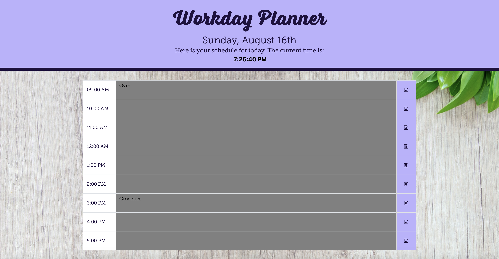

# Work Day Planner
Created using HTML and JavaScript (jQuery). This app also incorporates the usage of the Moment.js library to display the date and time. Events can be entered in the row corresponding to the time, which can then be saved. The color/focus of the row changes with the time: grey being time past, light green being the current hour and light orange for events later in the day.

